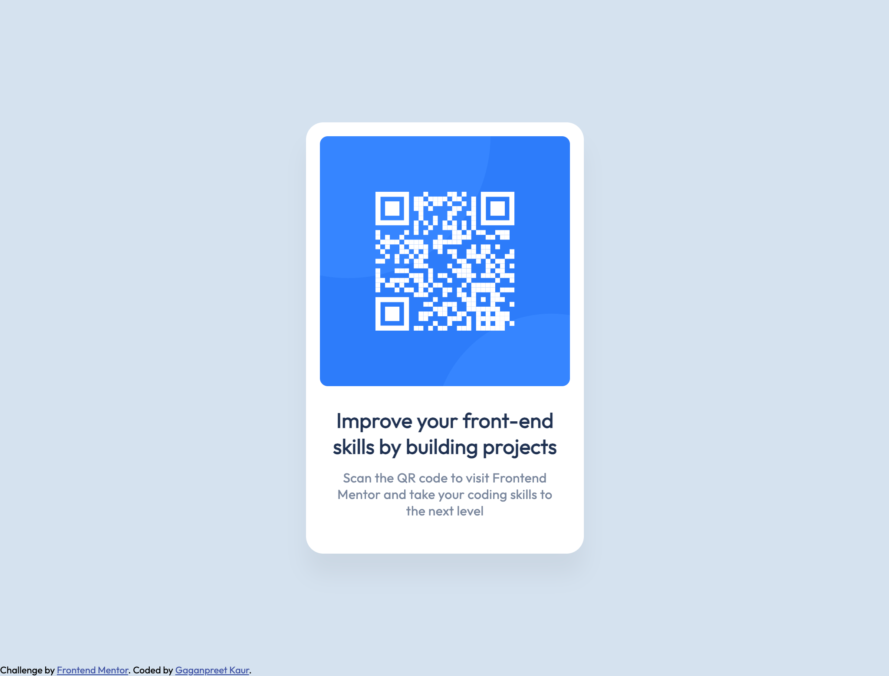

# Frontend Mentor - QR code component solution

This is a solution to the [QR code component challenge on Frontend Mentor](https://www.frontendmentor.io/challenges/qr-code-component-iux_sIO_H). Frontend Mentor challenges help you improve your coding skills by building realistic projects. 

## Table of contents

- [Overview](#overview)
  - [Screenshot](#screenshot)
  - [Links](#links)
- [My process](#my-process)
  - [Built with](#built-with)
  - [Useful resources](#useful-resources)
- [Author](#author)
- [Acknowledgments](#acknowledgments)

## Overview
This is the first chalenge I have done on Frontend Mentor. It builds the basic understanding of html and css. I used the figma to implement the css styles.

### Screenshot

This is a screenshot of the final version of the code for desktop.

This is a screenshot of the final version of the code for mobile devices.

### Links

- Solution URL: [Add solution URL here](https://your-solution-url.com)

## My process

To ease the process of coding I divided the body section into main and footer. The main consists of all the QR components. I have used the flex on the body section to display the main in the center of the screen. The major padding value is provided to the main section as it ease the process of media queries. The developemet is done keeping in mind of "Mobile-first solution".

### Built with

- Semantic HTML5 markup
- CSS custom properties
- Flexbox
- Mobile-first workflow

### Useful resources

- [Resource 1](https://developer.mozilla.org/en-US/docs/Web/CSS) - This helped me to brush up the basic concepts of CSS and helped in media queries.
- [Resource 2](https://css-tricks.com/) - This is an amazing website to get the basic idea of CSS properties with the help of visualization.

## Author

- Frontend Mentor - [@GaganpreetKaurGill](https://www.frontendmentor.io/profile/@GaganpreetKaurGill)

